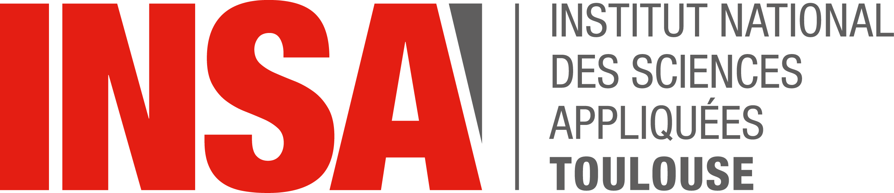

# 👋 Hi, I'm **Anya Meetoo** 

> **Computer Engineering Student** @ INSA Toulouse (ISS - Innovative Smart Systems)
> 📅 Graduating: **September 2026**
> 🇫🇷 Toulouse, France | Open to relocate in France | 🇲🇺 Mauritian 

🔗 [GitHub](https://github.com/AnyaMeetoo492) · 📧 [Email](mailto:anyameetoo@gmail.com) · 💼 [LinkedIn](https://www.linkedin.com/in/anyameetoo/) · 📄 [Resume](https://resume-cyan-six-57.vercel.app/)

---

## 🎯 Current Interests

🔌  · 
🌐  · 
🤖  · 
🧠  · 
🖨️​ 

---

## 👩‍🎓​ About Me

I am a **Computer Engineering** student at INSA Toulouse, specializing in Innovative Smart Systems, with a strong interest in **embedded software development, IoT systems and hardware/software integration**. I am graduating in **September 2026**! 🎉

Through my academic projects, I have worked on **connected devices, embedded AI, wireless sensor networks, IoT security and autonomous robotics**. My projects include an **end-to-end LoRa-based smart gas sensor system**, a **CNN model optimized for edge AI**, and a **quadruped robot project** involving FPGA-based processing, depth-camera perception, GSM communication and energy constraints.

I am currently looking for an opportunity in **embedded software engineering**, where I can contribute to reliable, efficient and hardware-aware systems in fields such as **IoT, robotics, industry, automotive or smart systems**.

---

## 💼 Professional Experience

| Company | Role | Timeline | Description |
|---------|------|----------|-------------|
| [**SCLE SFE**](https://www.scle.fr/) | Software Engineering Intern | 2026 | Developed C++ image editing module with Qt, SVG integration, and industrial desktop applications |
| [**Qt Company**](https://www.qt.io/) | QA Engineer Intern | 2025 | Built UI crash datasets using REST APIs, reproduced critical issues, contributed to autonomous testing systems |
| [**Mauritius Telecom**](https://www.telecom.mu/) | Network Engineering Intern | 2024 | Analyzed 2G→5G infrastructure evolution, built Power BI dashboards with real network telemetry data |
| [**SD Worx Mauritius**](https://www.sdworx.com/) | Intern | Jul 2022 | Learned full-stack web development (HTML, CSS, Bootstrap, C#, SQL) with hands-on project experience |

---

## 🚀 Featured Projects

| Project | Description | Tech |
|---------|-------------|------|
| 🧠 **Embedded AI Fall Detection** | CNN-based fall detection with 94.5% accuracy, optimized from 3.6MB → 1.6MB | TensorFlow · Keras |
| 🌐 [**Smart Gas Sensor System**](https://github.com/MOSH-Insa-Toulouse/2025-2026-5ISS-MEETOO-MIRANVILLE-REVELLI) | Full-stack IoT: custom sensors, LoRa communication, ChirpStack, mobile app | LoRa · KiCAD · IoT |
| 🤖 **Quadruped Robot Locomotion** | FPGA-accelerated locomotion, RealSense depth, AI gait optimization | FPGA · Robotics · C++ |
| ☁️ [**Smart Wine Cellar**](https://github.com/AnyaMeetoo492/5ISS_Architecture_de_service) | Microservices architecture with 10+ services, REST APIs, real-time monitoring | Java · Spring Boot |
| 🔧 [**STM32 Sailboat Controller**](https://github.com/bongibault-romain/insa-voilier) | Bare-metal C drivers: GPIO, UART, ADC, PWM, NVIC interrupts | C · STM32 |
| 🧩 [**Graph Algorithms**](https://github.com/AnyaMeetoo492/BE_Graphes)  | Dijkstra & A* implementation with clean architecture | Java · Maven |
| 🧩 [**Compiler (Lex & Yacc)**](https://github.com/AnyaMeetoo492/CompilateurC) | Complete compiler pipeline with lexical & syntax analysis | C · Parsing |
| 🎮 [**Minesweeper Web Game**](https://github.com/AnyaMeetoo492/ProgWeb) | Interactive game with difficulty levels & animations | JavaScript · GitHub Pages |

---

## 🎓 Education

| Timeline | Institution | Degree |
|----------|-------------|--------|
| 2022 - 2026 | [INSA Toulouse](https://www.insa-toulouse.fr/)    | Engineering Degree – Computer Science (IR-ISS - Innovative Smart Systems)   📅 Graduating: **September 2026** |
| 2021 - 2022 | [Université Paul Sabatier Toulouse III](https://www.univ-tlse3.fr/)    | Bachelor 1 – Computer Science |
| 2014 - 2021 | Loreto College Quatre Bornes | Higher School Certificate – Mathematics & Computer Science |

---

## 🌐 Languages

| Language | Proficiency | Certification |
|----------|-------------|----------------|
| 🇬🇧 English | Native or bilingual (C1) | TOEIC 985/990 |
| 🇫🇷 French | Native or bilingual (C1) | DALF |
| 🇲🇺 Mauritian Creole | Native | — |

---

## 🧰 Tech Stack

**Languages**  

**Embedded & Hardware**  

**Frameworks & Libraries**  

**Tools & DevOps**  

---

**📝 Note:** This README was created with the help of [GitHub Copilot](https://github.com/features/copilot) ✨
